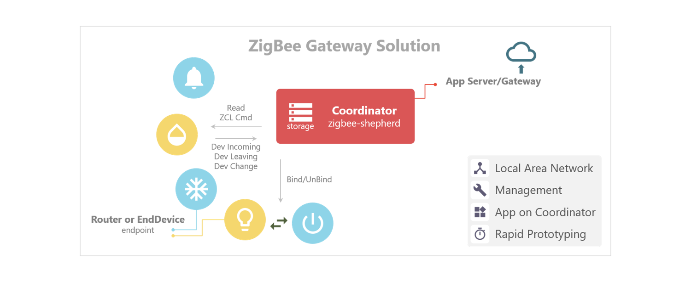

# Introduction

## Overview  

**zigbee-bridge** is an open source ZigBee gateway solution with node.js. It uses TI's [CC253X](http://www.ti.com/lsds/ti/wireless_connectivity/zigbee/overview.page) wireless SoC as a [zigbee network processor (ZNP)](http://www.ti.com/lit/an/swra444/swra444.pdf), and takes the ZNP approach with [zigbee-bridge-znp](https://github.com/open-zigbee/zigbee-bridge-znp) to run the CC253X as a coordinator and to run `zigbee-bridge` as the host.

Here is a [**demo webapp**](https://github.com/zigbeer/zigbee-demo#readme) that shows a simple smart home application built with **zigbee-bridge**.



`zigbee-bridge` has carried many network managing things for you, i.e., storing(/reloading) connected devices and endpoints records to(/from) the built-in database, permission of device joining, endpoints binding, and indications of device incoming and leaving.  

This gateway solution also works well with the ZigBee ZCL application framework - [**_zive_**](https://github.com/zigbeer/zive) to help developers build zigbee application with a real endpoint on the coordinator. With **_zive_**, third-parties can independently make their zigbee applications as plugins without knowing of the z-stack behavior. The concept of the plugin is really cool. When you want a zigbee IAS (Intruder Alarm System) application on your gateway, just download the plugin and register it to `zigbee-bridge`, and now you have an IAS service at your home in seconds. (I'm now working on a CIE (Control and Indicating Equipment) plugin for the zigbee IAS application.)

`zigbee-bridge` provides a nice environment for front-end and back-end web developers to use their familiar language - _**JavaScript**_, to build ZigBee applications. With node.js, you can have your own RESTful APIs to bring ZigBee machines to web world, push machines to the cloud, have a great machine database, create an account system, and build any fascinating GUI and dashboard with many cool UI frameworks. With `zigbee-bridge`, now web developers can do a lot of IoT things with ZigBee! It brings opportunities for app developers as well as opening another way of implementing IoT applications with ZigBee devices.

Let's do something fun with ZigBee! I hope you enjoy it!

## Installation

> $ npm install zigbee-bridge --save

## Hardware

- [SmartRF05EB (with CC2530EM)](http://www.ti.com/tool/cc2530dk)
- [CC2531 USB Stick](http://www.ti.com/tool/cc2531emk)
- CC2538 (Not tested yet)
- CC2630/CC2650 (Not tested yet)

## Firmware

To use CC2530/31 as the coordinator, please download the [**pre-built ZNP image**](https://github.com/Koenkk/Z-Stack-firmware) to your chip first. The pre-built image has been compiled as a ZNP with ZDO callback, ZCL supports, and functions we need.

## Usage

* Start the bridge

```js
const ZBridge = require('zigbee-bridge');
const bridge = new ZBridge('/dev/ttyUSB0'); // create a ZigBee server

bridge.on('ready', () => {
  console.log('Server is ready.');
  // allow devices to join the network within 60 secs
  bridge.permitJoin(60, (err) => {
    if (err) {
      console.log(err);
    }
  });
});

bridge.start((err) => { // start the server
  if (err) {
    console.log(err);
  }
});
```

* Interact with remote endpoints, here is a quick example:

```js
// find the joined endpoint by its address and endpoint id
const ep = bridge.find('0x00124b0001ce4beb', 6);    // returns undefined if not found

// use foundation command to read attributes from a remote endpoint
ep.foundation('genBasic', 'read', [{ attrId: 3 }, { attrId: 4 }], (err, rsp) => {
  if (!err) {
    console.log(rsp);
    // [
    //   { attrId: 3, status: 0, dataType: 32, attrData: 0 },
    //   { attrId: 4, status: 0, dataType: 66, attrData: 'TexasInstruments' }
    // ]
  }
});

// or use the shorthand read() method to read a single attribute
ep.read('genBasic', 'manufacturerName', (err, data) => {
  if (!err) {
    console.log(data); // 'TexasInstruments'
  }
});

// use functional command to operate a remote endpoint
ep.functional('genOnOff', 'toggle', {}, (err, rsp) => {
  if (!err) {
    console.log(rsp); // { cmdId: 2, statusCode: 0 }
  }
});
```